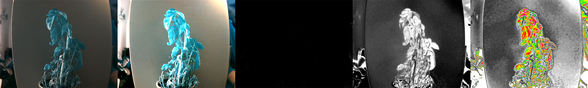
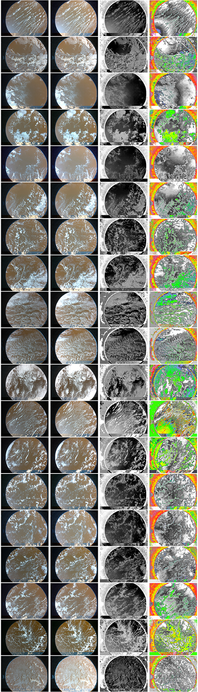

# Astropi 22/23

## Team: Leniwce :D

## Connect to openvpn

```sh
sudo openvpn --client --config /etc/openvpn/client.conf
```

## Useful commands

If other process is claiming the camera try:

```sh
sudo pkill raspimjpeg
```

Take image using cmd and save it to a file

```sh
raspistill -o image-test.png
```

## Test data

To interpret the data you can look at this reference image:



And here is reference from satalite image taken from raspberry pi foundation article about NDVI index:



### Frankoslaws picture - you can find picture of my pelargonia in `fl-test-data` folder

### Raspbbery pi NDVI tutorial park image - you can download this image using these commands

```sh
wget https://projects-static.raspberrypi.org/projects/astropi-ndvi/2cc9d1033d9c4f05388632e7912a4bb5531b3d94/en/images/park.png
```

### Astro pi pictures - you can fin satelitary data on astro pi site

Inside this folder most important are files with prefix: `photo_`.

```sh
wget https://rpf.io/p/en/astropi-ndvi-go
file astropi-ndvi-go
unzip -q astropi-ndvi-go -d satelite-data
```

### Dependencies, fastiecam is only used for data representation
